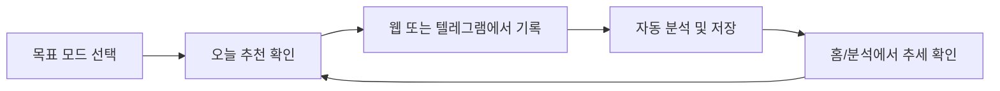

# Iron Quant


단일 사용자 운동 기록 앱입니다.  
웹과 텔레그램을 함께 사용해 기록을 빠르게 남기고, 목표에 맞는 추천을 받도록 설계되어 있습니다.

## 빠른 이동
- [3분 시작](#3분-시작)
- [모드 한눈에 보기](#모드-한눈에-보기)
- [웹 사용법](#웹-사용법)
- [텔레그램 사용법](#텔레그램-사용법)
- [배포 체크리스트](#배포-체크리스트)
- [보안 체크리스트](#보안-체크리스트)
- [문제 해결](#문제-해결)

## 3분 시작
| 단계 | 해야 할 일 | 확인 포인트 |
|---|---|---|
| 1 | `npm install` | 의존성 설치 완료 |
| 2 | `npm run dev` | 로컬 서버 실행 |
| 3 | 웹 접속 후 기록 입력 | 첫 기록 저장 성공 |

```bash
npm install
npm run dev
```

## 모드 한눈에 보기
| 항목 | 감량 모드 (`fat_loss`) | 근육 모드 (`muscle_gain`) |
|---|---|---|
| 홈 핵심 카드 | 주간 유산소 목표 진행률, 칼로리 | 3대 1RM, 자산 지표 |
| 추천 방향 | 유산소 시간/회복 중심 | 중량/볼륨 중심 |
| 기록 템플릿 예시 | `러닝머신 30 1 1` | `스쿼트 100 5 5` |

## 기록 입력 예시
### 근육 모드
```text
스쿼트 100 5 5
벤치 60x10x5 @9
데드 120 5 5
```

### 감량 모드
```text
러닝머신 30 1 1
빠르게걷기 25 1 1
사이클 35 1 1
```

## 웹 사용법
### 홈
- 현재 모드 기준 핵심 지표 확인
- 오늘 추천 확인 후 바로 기록 시작

### 기록
- 여러 줄 텍스트 입력 가능
- 최근 기록 불러오기/템플릿 버튼 지원

### 분석
- 최근 기록, 주간 요약, CSV/JSON 내보내기

### 내 정보
- 목표 모드, 신체 정보, 1RM 수정
- 동기화 상태 확인: `저장됨 / 동기화중 / 완료 / 충돌 / 실패`

## 텔레그램 사용법
### 고정 버튼
| 버튼 | 동작 |
|---|---|
| `기록` / `유산소 기록` | 입력 예시 안내 |
| `오늘 추천` | 모드 기반 추천 표시 |
| `마지막 수정` | `/edit ...` 예시 제공 |
| `상태` | 현재 상태 리포트 |
| `도움말` | 명령어 목록 |
| `앱 열기` | 웹 앱 바로 열기 |

### 명령어 치트시트
| 명령어 | 설명 |
|---|---|
| `/status` 또는 `자산` | 현재 상태 리포트 |
| `/rec` 또는 `추천` | 오늘 추천 |
| `/mode fat\|muscle` 또는 `mode fat\|muscle` | 모드 전환 |
| `/last` | 마지막 운동 조회 |
| `/edit ...` | 마지막 운동 수정 |
| `/undo` 또는 `/undo!` | 마지막 운동 삭제 |
| `/export csv\|json` | 데이터 내보내기 |
| `/remind ...` | 리마인더 설정 |
| `/debug` | 연결 상태 점검 |

## 사용 흐름


## 배포 체크리스트
이 프로젝트는 정적 배포가 아니라 **Vercel + API Routes** 기준입니다.

1. Supabase SQL 실행
- `supabase/schema.sql`
- 기존 DB면 추가:
  - `supabase/telegram_reminder_patch.sql`
  - `supabase/goal_mode_patch.sql`

2. Vercel 환경변수 설정
- `NEXT_PUBLIC_SUPABASE_URL`
- `NEXT_PUBLIC_SUPABASE_ANON_KEY`
- `SUPABASE_URL`
- `SUPABASE_SERVICE_ROLE_KEY`
- `APP_SECRET`
- `TELEGRAM_BOT_TOKEN`
- `TELEGRAM_WEBHOOK_SECRET`
- `APP_URL`

3. Telegram webhook를 현재 배포 도메인으로 설정
- `https://<your-domain>/api/telegram`

상세 문서는 아래 참고:
- `DB_SETUP.md`
- `DEPLOY_GUIDE.md`

## 보안 체크리스트
- 민감정보(토큰/키/시크릿) Git 커밋 금지
- 공개 배포 시 `APP_SECRET` 잠금 사용
- 특히 아래 값 노출 금지
  - `SUPABASE_SERVICE_ROLE_KEY`
  - `TELEGRAM_BOT_TOKEN`
  - `TELEGRAM_WEBHOOK_SECRET`
  - `APP_SECRET`

## 문제 해결
### 텔레그램 버튼/명령이 안 먹는 경우
1. `/debug` 실행
2. webhook URL이 현재 배포 도메인인지 확인
3. Vercel 최신 배포 확인

### 저장/동기화 문제
1. 잠금 해제(`APP_SECRET`) 확인
2. Supabase 환경변수 확인
3. `내 정보`에서 동기화 상태 확인 후 재시도

---
필요하면 다음 단계로 `README`에 실제 UI 스크린샷 섹션을 추가해서 온보딩 문서로 완성할 수 있습니다.
